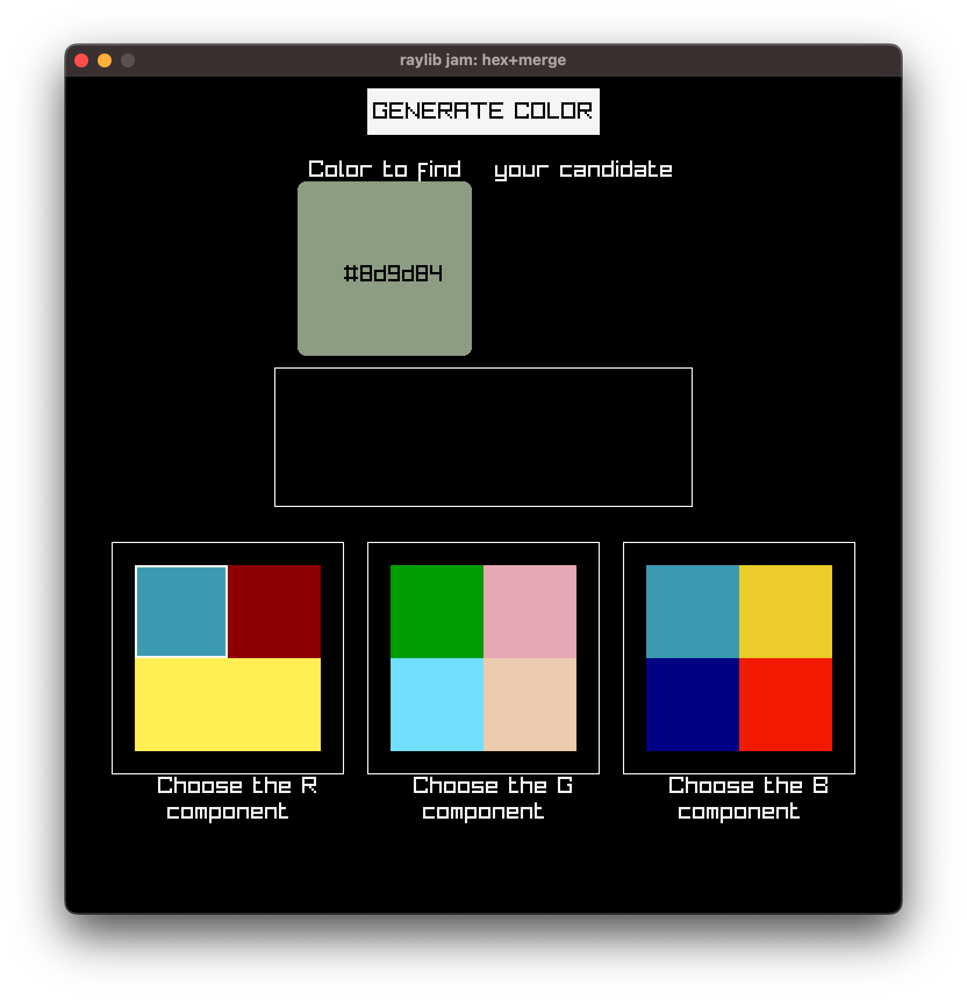
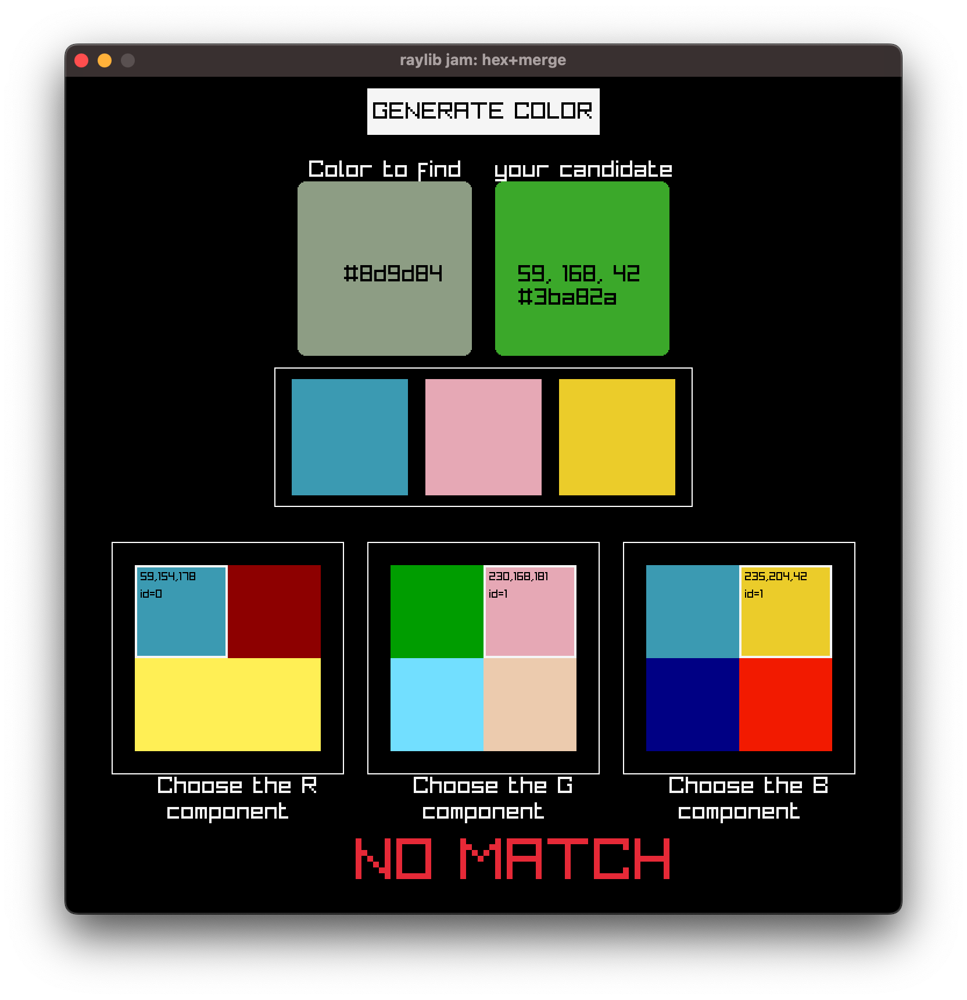

-----------------------------------

## Find the Hex

### Description

- you are given a random color fow which you only know the `hex` value
- you need to find each of its `RGB` component and `merge` them to reconstitute the original color
- for each component, the real value is hidden between 3 other fakes
- you can choose each component in different order, i.e starting from `B`, then `R` then `G`
- once a component is chosen, you can't go back

### Features

 - puzzle game
 - very quick gameplay

### Controls

Mouse

### Screenshots

 

### Developers

 - $(me) - $(all)

### Links

 - itch.io Release: $(itch.io Game Page)

### License

This project sources are licensed under an unmodified zlib/libpng license, which is an OSI-certified, BSD-like license that allows static linking with closed source software. Check [LICENSE](LICENSE) for further details.

*Copyright (c) $(2026) $(jonathanbouchet)*
