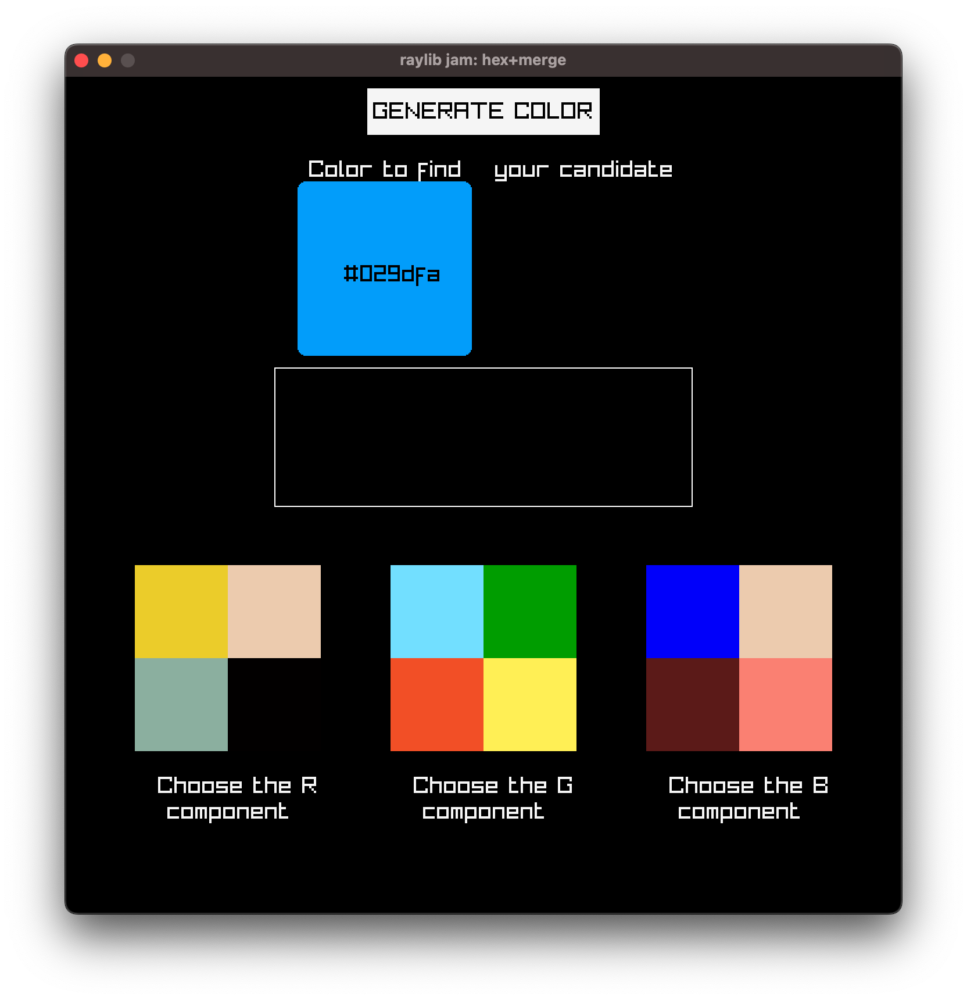
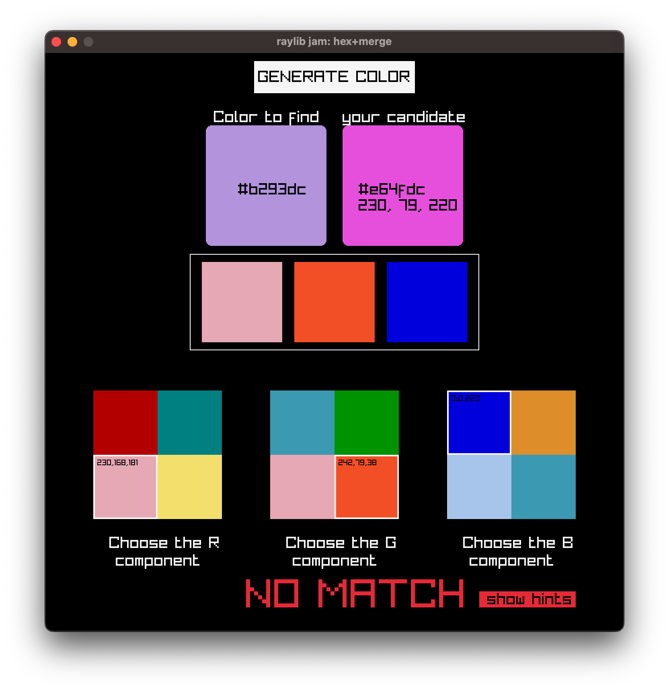

-----------------------------------

## Find the Hex

### Description

- you are given a random color fow which you only know the `hex` value
- you need to find each of its `RGB` component and `merge` them to reconstitute the original color
- for each component, the real value is hidden between 3 other fakes
- you can choose each component in different order, i.e starting from `B`, then `R` then `G`
- once a component is chosen, you can't go back
- `show hints` will show the `RGB` components of the real value and those you have chosen

### Features

 - puzzle game
 - very quick gameplay
 - python 3.13
 - no music/sound

### Controls

Mouse

### Screenshots

 

 

 

 



### Installation

#### `uv`

```python
uv sync
uv run main.py
```

#### `with pygbag`
```python
pygbag --build --html src/main.py
```

#### Built provided 
- `dist.zip` is the package app created with `pyinstaller`
- `find_the_hex_v0.zip` is the web built for `itch.io`

### Developers

 - $(me) - $(all)

### Links

 - itch.io Release: https://jonathanbouchet.itch.io/findthehex

### License

This project sources are licensed under an unmodified zlib/libpng license, which is an OSI-certified, BSD-like license that allows static linking with closed source software. Check [LICENSE](LICENSE) for further details.

*Copyright (c) $(2026) $(jonathanbouchet)*
